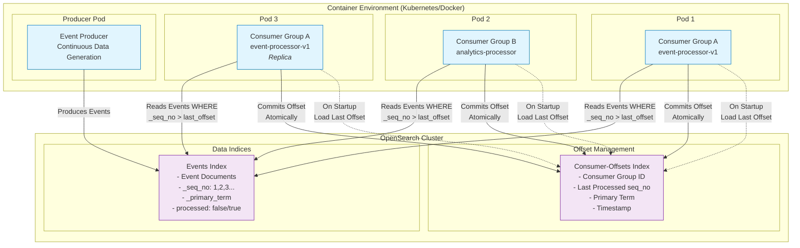
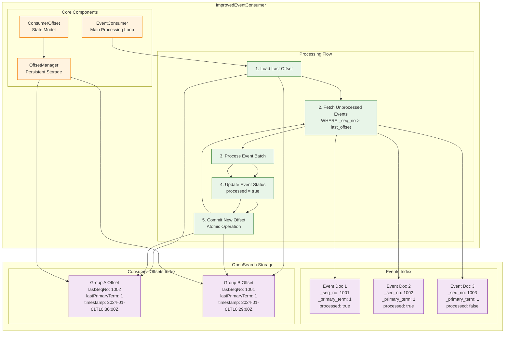
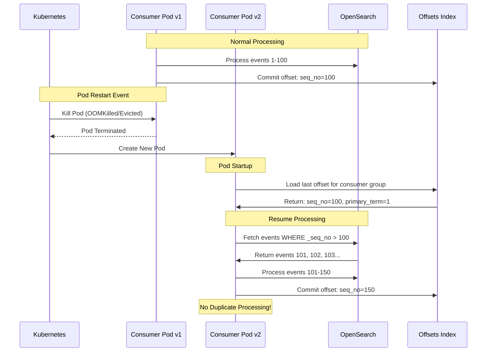
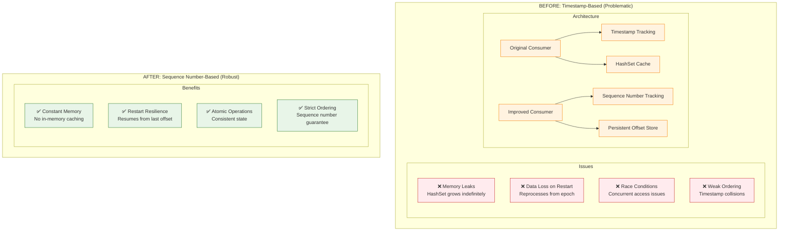

# OpenSearch Event Streaming Architecture with Persistent Offset Management

## High-Level System Architecture

## Detailed Component Architecture

## Container Restart Resilience Flow

## Comparison: Before vs After

## Deployment Architecture for Organizations

```mermaid
graph TB
    subgraph "Production Environment"
        subgraph "Namespace: data-processing"
            subgraph "Consumer Deployments"
                CD1[Consumer Deployment<br/>Replicas: 3<br/>Group: analytics-v1]
                CD2[Consumer Deployment<br/>Replicas: 2<br/>Group: notifications-v1]  
                CD3[Consumer Deployment<br/>Replicas: 1<br/>Group: audit-v1]
            end
            
            subgraph "Producer Deployment"  
                PD[Producer Deployment<br/>Replicas: 2<br/>Event Generation]
            end
        end
        
        subgraph "ConfigMaps & Secrets"
            CM[ConfigMap<br/>- OpenSearch endpoints<br/>- Index names<br/>- Consumer groups]
            SEC[Secret<br/>- OpenSearch credentials<br/>- SSL certificates]
        end
        
        subgraph "Monitoring"
            MON[Prometheus Metrics<br/>- Events processed<br/>- Offset lag<br/>- Consumer health]
            LOG[Structured Logging<br/>- JSON format<br/>- ELK stack integration]
        end
    end

    subgraph "OpenSearch Cluster"
        subgraph "Data Tier"
            ES1[OpenSearch Node 1<br/>Master + Data]
            ES2[OpenSearch Node 2<br/>Master + Data]
            ES3[OpenSearch Node 3<br/>Data Only]
        end
        
        subgraph "Indices"
            EVI[Events Index<br/>Shards: 5, Replicas: 1]
            OFI[Offsets Index<br/>Shards: 1, Replicas: 1]
        end
    end

    CD1 --> EVI
    CD2 --> EVI  
    CD3 --> EVI
    PD --> EVI
    
    CD1 --> OFI
    CD2 --> OFI
    CD3 --> OFI

    CD1 --> CM
    CD2 --> CM
    CD3 --> CM
    PD --> CM
    
    CD1 --> SEC
    CD2 --> SEC  
    CD3 --> SEC
    PD --> SEC

    CD1 --> MON
    CD2 --> MON
    CD3 --> MON
    PD --> MON

    CD1 --> LOG
    CD2 --> LOG
    CD3 --> LOG
    PD --> LOG

    ES1 --- ES2
    ES2 --- ES3
    ES1 --- ES3

    classDef deployment fill:#e3f2fd,stroke:#1976d2
    classDef storage fill:#f3e5f5,stroke:#7b1fa2  
    classDef config fill:#fff8e1,stroke:#f57c00
    classDef monitoring fill:#e8f5e8,stroke:#388e3c
    
    class CD1,CD2,CD3,PD deployment
    class ES1,ES2,ES3,EVI,OFI storage
    class CM,SEC config
    class MON,LOG monitoring
```

## Business Value Proposition

### Cost Savings
- **Reduced Resource Usage**: No memory leaks = lower memory requirements
- **Eliminated Data Reprocessing**: Saves compute costs from duplicate processing
- **No External Dependencies**: No need for additional databases or storage systems

### Operational Excellence  
- **Zero Downtime Deployments**: Consumers resume seamlessly after restarts
- **Horizontal Scaling**: Multiple consumer groups for different use cases
- **Self-Healing**: Automatic recovery from pod failures

### Risk Mitigation
- **Data Consistency**: Atomic offset commits prevent data loss
- **Audit Trail**: Complete processing history in offset index
- **Container Native**: Designed for modern containerized environments

### Developer Experience
- **Simple Configuration**: Uses existing OpenSearch cluster
- **Clear Monitoring**: Built-in metrics and logging
- **Easy Debugging**: Offset state is queryable and transparent